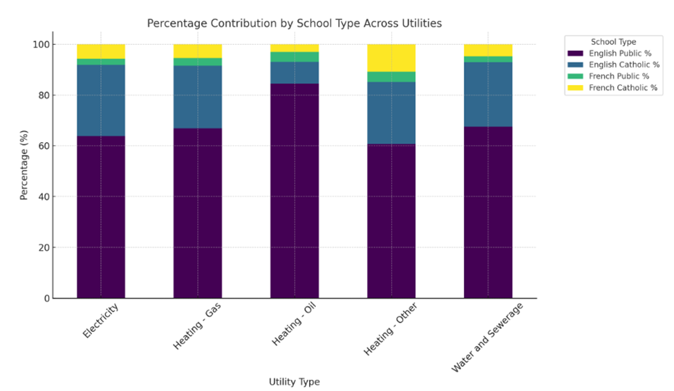
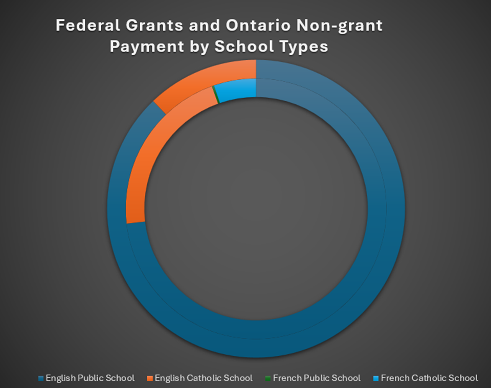

# Data Visualization

## Assignment 4: Final Project

### Requirements:
- We will finish this class by giving you the chance to use what you have learned in a practical context, by creating data visualizations from raw data. 
- Choose a dataset of interest from the [City of Toronto’s Open Data Portal](https://www.toronto.ca/city-government/data-research-maps/open-data/) or [Ontario’s Open Data Catalogue](https://data.ontario.ca/). 
- Using Python and one other data visualization software (Excel or free alternative, Tableau Public, any other tool you prefer), create two distinct visualizations from your dataset of choice.  
- For each visualization, describe and justify: 

    > What software did you use to create your data visualization?
    The visualization was created using Python, specifically the Matplotlib and Seaborn libraries. These tools allow for flexible and professional data representation while providing advanced customization options for better clarity.

    > Who is your intended audience? 
    The intended audience includes Ontario policymakers, school boards, environmental analysts, and stakeholders in energy management. They are key decision-makers responsible for improving energy efficiency and reducing costs in schools.
    
    > What information or message are you trying to convey with your visualization?
    The visualization conveys the variations in energy consumption across different utility types and school categories in Ontario. It highlights patterns in energy use to inform potential optimization strategies and sustainability initiatives. 
    
    > What design principles (substantive, perceptual, aesthetic) did you consider when making your visualization? How did you apply these principles? With what elements of your plots? 
    Substantive principles ensured the data was accurate and representative of the energy usage patterns. Perceptual principles were applied by using clear, distinct color stacks for each energy type to aid comparison between school categories. Aesthetic principles were addressed by keeping the design professional, uncluttered, and focused on readability, aligning with the preferences of policymakers and administrators.
    
    > How did you ensure that your data visualizations are reproducible? If the tool you used to make your data visualization is not reproducible, how will this impact your data visualization? 
    The visualization process is entirely reproducible, as it is based on documented Python code and open-source libraries. Anyone with access to the data and code can recreate the visualizations. Using reproducible tools ensures transparency and the ability to verify findings.
    
    > How did you ensure that your data visualization is accessible?  
    To ensure accessibility, I used color palettes that are colorblind-friendly and ensured adequate contrast between the bars. Clear labeling, legends, and tooltips were included to help viewers easily interpret the data, regardless of visual or cognitive abilities.
    
    > Who are the individuals and communities who might be impacted by your visualization?  
    The visualization impacts Ontario’s school boards, energy providers, and policymakers. It also indirectly affects students, parents, and the wider community by contributing to more energy-efficient schools, potentially leading to cost savings and environmental benefits.
    
    > How did you choose which features of your chosen dataset to include or exclude from your visualization? 
    I included key variables: energy types (electricity, heating), school types (public, Catholic, French, English), and subcategories (day school, elementary, secondary). Less relevant data, such as non-energy-related metrics, was excluded to maintain focus on actionable insights and to avoid overwhelming the audience with unnecessary details.
    
    > What ‘underwater labour’ contributed to your final data visualization product?
    Extensive data cleaning, validation, and transformation efforts were required to ensure consistency and accuracy. Verifying calculations, resolving missing values, and creating aggregated metrics also involved significant manual and computational effort. Testing various chart designs and iterating based on readability and clarity were key to delivering an effective final product.

    > What software did you use to create your data visualization?
    The visualization was created using Microsoft Excel's charting tools, specifically its built-in donut chart feature.

    > Who is your intended audience? 
    The intended audience includes policymakers, school administrators, and analysts tasked with understanding the allocation of federal grants and non-grant payments across Ontario schools.

    > What information or message are you trying to convey with your visualization?
    The visualization demonstrates how federal grants and Ontario non-grant payments are distributed among different types of schools: English Public, English Catholic, French Public, and French Catholic. The goal is to highlight any imbalances or trends in financial support.

    > What design principles (substantive, perceptual, aesthetic) did you consider when making your visualization? How did you apply these principles? With what elements of your plots? 
    •	Substantive: Focused on representing accurate data from the source and directly relating to funding distribution across Ontario schools.
    •	Perceptual: Used distinct colors for each school type to ensure clear differentiation. The donut chart format simplifies comparison while avoiding visual clutter.
    •	Aesthetic: Selected a dark background and vibrant segment colors to improve contrast and visual appeal. The title is clear and concise, and the legend is positioned for easy reference.

    > How did you ensure that your data visualizations are reproducible? If the tool you used to make your data visualization is not reproducible, how will this impact your data visualization? 
    Excel is widely available and provides consistent functionality across versions, making the visualization reproducible. Users can recreate the chart by following the same steps in Excel. If a non-reproducible tool were used, it would limit accessibility and credibility.

    > How did you ensure that your data visualization is accessible?  
    The visualization is accessible due to its clean layout, distinct color-coding, and readable text. Labels and legends provide essential context, ensuring that users with basic Excel knowledge can interpret the chart. It can also be exported as an image or PDF for broader accessibility.

    > Who are the individuals and communities who might be impacted by your visualization?  
    The visualization could impact government officials, school boards, and community advocates by providing insights into funding disparities. It could also inform discussions about equitable resource allocation among Ontario schools.

    > How did you choose which features of your chosen dataset to include or exclude from your visualization? 
    The dataset contained a variety of financial information, but only federal grants and non-grant payments were included to focus on a clear, actionable message. Other unrelated metrics were excluded to avoid diluting the visualization’s purpose.

    > What ‘underwater labour’ contributed to your final data visualization product?
    This included organizing the raw dataset, calculating totals for each school type, formatting the chart in Excel, and iteratively refining the design for clarity. Additional time was spent aligning the chart’s aesthetics with its intended audience.

- This assignment is intentionally open-ended - you are free to create static or dynamic data visualizations, maps, or whatever form of data visualization you think best communicates your information to your audience of choice! 
- Total word count should not exceed **(as a maximum) 1000 words** 
 
### Why am I doing this assignment?:  
- This ongoing assignment ensures active participation in the course, and assesses the learning outcomes: 
* Create and customize data visualizations from start to finish in Python
* Apply general design principles to create accessible and equitable data visualizations
* Use data visualization to tell a story  
- This would be a great project to include in your GitHub Portfolio – put in the effort to make it something worthy of showing prospective employers!

### Rubric:

| Component         | Scoring  | Requirement                                                                 |
|-------------------|----------|-----------------------------------------------------------------------------|
| Data Visualizations | Complete/Incomplete | - Data visualizations are distinct from each other - Data visualizations are clearly identified - Different sources/rationales (text with two images of data, if visualizations are labeled) - High-quality visuals (high resolution and clear data) - Data visualizations follow best practices of accessibility |
| Written Explanations | Complete/Incomplete | - All questions from assignment description are answered for each visualization - Explanations are supported by course content or scholarly sources, where needed |
| Code              | Complete/Incomplete | - All code is included as an appendix with your final submissions - Code is clearly commented and reproducible |

## Submission Information

🚨 **Please review our [Assignment Submission Guide](https://github.com/UofT-DSI/onboarding/blob/main/onboarding_documents/submissions.md)** 🚨 for detailed instructions on how to format, branch, and submit your work. Following these guidelines is crucial for your submissions to be evaluated correctly.

### Submission Parameters:
* Submission Due Date: `HH:MM AM/PM - DD/MM/YYYY`
* The branch name for your repo should be: `assignment-4`
* What to submit for this assignment:
    * A folder/directory containing:
        * This file (assignment_4.md)
        * Two data visualizations 
        * Two markdown files for each both visualizations with their written descriptions.
        * Link to your dataset of choice.
        * Complete and commented code as an appendix (for your visualization made with Python, and for the other, if relevant) 
* What the pull request link should look like for this assignment: `https://github.com/<your_github_username>/visualization/pull/<pr_id>`
    * Open a private window in your browser. Copy and paste the link to your pull request into the address bar. Make sure you can see your pull request properly. This helps the technical facilitator and learning support staff review your submission easily.

Checklist:
- [ ] Create a branch called `assignment-4`.
- [ ] Ensure that the repository is public.
- [ ] Review [the PR description guidelines](https://github.com/UofT-DSI/onboarding/blob/main/onboarding_documents/submissions.md#guidelines-for-pull-request-descriptions) and adhere to them.
- [ ] Verify that the link is accessible in a private browser window.

If you encounter any difficulties or have questions, please don't hesitate to reach out to our team via our Slack at `#cohort-3-help`. Our Technical Facilitators and Learning Support staff are here to help you navigate any challenges.
